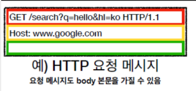

## 1주차(4.5 ~ 4.14)

### 세션 내용

- 네트워크에 대한 이해
    - TCP/IP 의 동작 이해
    - 3-Hand Shaking 에 대한 이해
- URL 구조 파악
- 개발자 도구 정보 파악
- 서버와 클라이언트에 대한 이해
- HTTP 요청, 응답 메시지에 대한 이해

## 클라이언트 & 서버
### 클라이언트와 서버의 개념
> 카페를 창업하려면..
  - 고객: 음료를 구매(요청)
  - 카페: 음료를 판매(응답)

> 웹서비스를 만들면..
  - 클라이언트: 페이지를 요청
  - 서버: 페이지를 응답

> 자판기 카페

  - 고객: 진열된 음료 선택
  - 자판기 카페: 미리 만들어진 음료 제공
  
  *정해진 음료만 제조 가능*
  
  - 클라이언트: 정적 페이지 요청
  - 서버: HTML,CSS,JS
  
  *정해진 HTML,CSS,JS 파일만 전달*

## 프로토콜 & 네트워크
> 클라이언트와 서버는 어떻게 통신을 할까?
### 프로토콜과 네트워크의 정의
**프로토콜**
  - 어떻게(HOW) 통신할지에 대한 방법을 정의해 놓은 것
  - 컴퓨터(Host) 간 통신에 필요한 규약, 양식

**네트워크**
  - 2개 이상의 컴퓨터(Host)들이 전송매체를 통해 서로 연결된 모임

### TCP/IP

**IP(Internet Protocol)**

데이터를 패킷이라는 작은 조각으로 나누어, 각 패킷에 목적지 주소를 부여하고, 이를 인터넷을 통해 전송하는 역할

**TCP(Transmission Control Protocol)**

IP에 의해 전송된 패킷들이 목적지에 도달했을 때, 이 패킷들을 원래의 순서대로 재조립하여, 최종적으로 수신자에게 온전한 데이터를 전달

**TCI/IP 계층** 
  
- Network Interface: 데이터 전송 작업 및 관련 데이터 명시(ex. 이더넷, WIFI 등)
- Network : 어디로 보낼 지 목적지 명시 (ex.IP 등)
- (Host-to-Host) Transport: 어떤 통신 방식으로 보낼 지 명시(ex.TCP,UDP 등)
- Applicaton: 어떤 목적으로 보낼 지, 어떤 종류의 데이터를 보낼 지 명시 (ex. HTTP, TLS/SSL, FTP, SMTP 등)

**3-Hand Shaking 에 대한 이해**

TCP/IP 프로토콜을 사용하여 송수신자 간에 신뢰할 수 있는 연결을 설정하는 과정

1. SYN(Synchronize): 클라이언트가 서버에게 연결 요청을 보냄
2. SYN-ACK(Synchronize-Acknowledgment): 서버가 요청을 받고 클라이언트에게 응답을 보냄
3. ACK(Acknowledgment): 클라이언트가 서버의 응답을 받고, 이를 서버에게 다시 확인시켜 주면서, 실제 데이터 전송 전에 안정적인 연결이 설정됌

## IP, 도메인

### **IP**

IT 환경의 주소 체계

### **도메인**

- IP 주소를 인식하기 쉬운 주소로 바꾼 주소
- 도메인 동작 원리
    
    1) url을 입력
    
    2) DNS 서버에 검색하기 전 캐싱된 DNS 기록 먼저 확인
    
    3) 가장 가까운 DNS 서버에서 IP 주소를 찾아 사용자가 입력한 url 정보와 함께 전달 ⇒ . → com → [google.com](http://google.com) 순서로
    
    4) 해당 웹사이트에 맞는 html 문서 요청 (TCP/IP 프로토콜 사용하여 서버로 전송)
    
    5) WAS와 DB에서 웹페이지 작업 처리 후 서버에 전송, 서버는 웹브라우저에게 전달
    
    6) 브라우저 렌더링 과정을 거쳐 웹페이지 화면 출력
    
    
    
    참고자료 [https://velog.io/@tnehd1998/주소창에-www.google.com을-입력했을-때-일어나는-과정?fbclid=IwAR0sr2lIuE_SGgQxIIoN4fpn5bgM8NSAtIBpaioGzVv07fF7yE2gNhvF2ps](https://velog.io/@tnehd1998/%EC%A3%BC%EC%86%8C%EC%B0%BD%EC%97%90-www.google.com%EC%9D%84-%EC%9E%85%EB%A0%A5%ED%96%88%EC%9D%84-%EB%95%8C-%EC%9D%BC%EC%96%B4%EB%82%98%EB%8A%94-%EA%B3%BC%EC%A0%95?fbclid=IwAR0sr2lIuE_SGgQxIIoN4fpn5bgM8NSAtIBpaioGzVv07fF7yE2gNhvF2ps)
    
- 서브 도메인
  
  하나의 도메인으로 부가적인 여러 도메인 사용 가능 → 비용 절약

## PORT

### **PORT**

하나의 컴퓨터 내에서 하나의 프로그램과 통신하기 위한 통로

### **리다이렉션**

받은 요청을 다시 지시하여 새로운 요청으로 지시하는 것

### **포트포워딩**

- 공유기에서 하나의 IP주소와 포트 번호 결합의 통신 요청을 다른 곳으로 넘겨줌
- 외부에서는 공유기에게 포트 요청, 공유기 뒤에 있는 기기에 직접 요청x
- 공유기가 어느 기기로 포트를 연결해야할지 모를 때 공유기에 이정표를 달아주는 것

## URI
### URI, URL, URN

#### URI (Uniform Resource Identifier)

- '통합 자원 식별자’
- 인터넷 상의 자원을 고유하게 식별하거나 참조하기 위한 문자열의 구조
- URL과 URN이 URI의 하위 개념

#### URL (Uniform Resource Locator)

- ‘통합 자원 지시자’
- 자원이 실제로 어디에 위치하고 있는지를 나타내기 위해 사용. 
- 일상적으로 우리가 웹 주소를 이야기할 때 사용하는 것이 URL임. 
- 예를 들어 `http://www.example.com/index.html`은 HTTP 프로토콜을 사용하여 `www.example.com`이라는 호스트의 `index.html`이라는 파일에 접근할 수 있는 URL이다 
- URL은 인터넷 상의 특정 자원의 위치를 명시하며, 어떻게 그 자원에 접근할 수 있는지에 대한 정보를 포함한다

#### URN (Uniform Resource Name)

- ‘통합 자원 이름’
- 리소스의 위치에 영향을 받지 않는 고유한 이름을 제공
- 예를 들어, ISBN(국제 표준 도서 번호)는 어떤 책에 대한 URN으로 사용될 수 있음.
- 자원의 실제 위치가 변경되어도 그 자원을 식별할 수 있음
- 잘 사용하진 않음

### 정리

- **URI**는 정보의 위치나 이름 또는 둘 모두를 식별할 수 있는 광범위한 개념
- **URL**은 실제 자원이 위치하는 주소(‘어디에’ 있는지)
- **URN**은 자원의 위치에 관계없이 그 자원을 고유하게 식별하는 이름 (‘무엇인지’)

**참고자료**

[1] https://cnu-jinseop.tistory.com/72

[2] https://blog.itcode.dev/posts/2021/05/29/uri-url-urn

## HTTP

### HTTP란?

- 웹 환경에서 서버와 클라이언트가 어떻게 데이터를 주고 받을지 정해 놓은 규칙
- 거의 모든 형태의 데이터 전송 가능
- HTML, TEXT / 이미지, 음성, 영상, 파일 / JSON, XML 등

### HTTP 주요 특징

> **클라이언트-서버 구조**
> 
- Request, Response 구조
- 클라이언트는 서버에 요청을 보내고, 응답을 대기
- 서버가 요청에 대한 결과를 만들어서 응답

> **무상태 프로토콜**
> 
- 상태유지
    - 서버가 클라이언트의 정보를 계속 가지고 있음
    - 클라이언트 정보를 가진 서버 외에는 정확한 응답 메세지를 주기 어렵다
    - 서버의 확장성이 떨어짐
    - 서버는 우리 상태를 항상 기억하고 있다고 가정하고 요청을 보냄
    
    
    
- 무상태
    - 서버가 클라이언트의 정보를 가지고 있지 않음
    - 클라이언트가 서버가 필요한 정보를 그 때마다 모두 보냄
    - 클라이언트 요청에 어느 서버든지 응답할 수 있다
    - 서버의 확장성이 높다(무한한 서버 증설 가능)
    - 서버는 우리 상태를 항상 잊어버린다고 가정하고 요청을 보냄
    
    
    

### HTTP 요청 메세지 구조

- 크게 시작라인, 헤더, 공백, 바디로 나뉨
- 시작 라인: HTTP 메서드, 요청 대상(PATH), HTTP 버전
- 헤더: HOST 정보, 부가 정보(인증 정보)
- 바디: 실제 전송할 데이터 (없을 수도 있음)

### HTTP 상태코드

- 클라이언트가 보낸 요청의 처리 상태를 응답에서 알려주는 기능
- 상태코드
    
    **1xx**(Informational): 요청이 수신되어 처리중
    **2xx**(Successful): 요청  정상  처리
    **3xx**(Redirection): 요청을  완료하려면 추가  행동이  필요
    **4xx**(Client Error): 클라이언트 오류, 잘못된  문법  등으로  서버가  요청을  수행할  수  없음
    **5xx**(Server Error): 서버  오류, 서버가 정상  요청을  처리하지 못함
    

## API

### API란?

- 어플리케이션 프로그래밍을 하는데 사용되는 인터페이스
    
    인터페이스: 서로 다른 2개의 요소에서 신호를 주고 받는 접점     
    
- 서버는 클라이언트에게 회원가입을 시키는 API를 URL 형태로 제공
- 클라이언트는 서버에서 무슨 로직으로 회원가입을 동작 시키는지 전혀 모른다
- ex) 로켓버튼 ⇒ 로켓이 발사!

### REST API

- HTTP 요청을 보낼 때, 메서드 + URL 형태로 개발자들 사이에 널리 지켜지는 약속
- 각 요청이 어떤 동작이나 정보를 위한 것인지를 요청 자체로 추측 가능
- 메서드는 행위(동사)를 나타내며, URL은 리소스(명사)를 나타낸다

### HTTP 메서드

- 대표적인 메서드에는 POST, GET, PATCH, PUT, DELETE 등이 있다
- 메서드
    
    POST: 생성
    GET: 조회
    PATCH, PUT: 수정
    DELETE: 삭제
    

Q. PATCH와 PUT의 차이점?  ⇒ 부분 수정, 전체 수정

### REST API 설계 규칙

ex) GET /users/blocked-sub-users

1. **요청하려는 기능에 맞게 메서드와 URL을 구분하여 기입**
    
    기능에  맞는  메서드를  먼저  선정
    메서드는  동사형, URL은  명사형(복수형)으로  기입한다.
    
2. **GET의 경우, 요청하려는 리소스에 맞게 path variable, query string 등을 기재한다.**
특정 리소스를 식별하고 싶다면, Path Variable 사용(정적 조회)
정렬이나 필터링 등을 하고싶다면, Query Parameter를 사용(동적 조회)

1. **URL에서 구분자는 –(하이픈)으로 한다.**

1. **리소스를 명사형으로 표현하기 애매한 상황엔 형용사를 섞는다. 단, 마지막은 명사형으로 유지**

