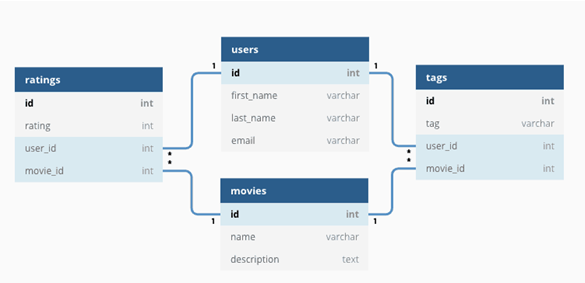
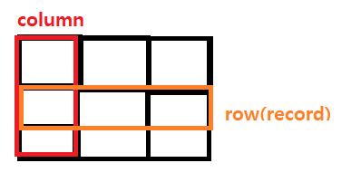

# 멋사 4주차 스터디 자료

## 데이터베이스란?

### 데이터베이스(DB)

- 여러 사람이 공유하여 사용할 목적으로 체계화, 통합, 관리하는 데이터의 집합
- 데이터베이스 관리 시스템(DBMS)에 의해 제어

### 데이터베이스 관리 시스템(DBMS)

- 데이터베이스에 접근하여 데이터 베이스 관리를 지원하는 소프트웨어 (워드,포토샵같은)
- MySQL, MariaDB, Oracle 등이 있음
- 크게 관계형, 비관계형 유형으로 나눔

## 관계형 데이터베이스(RDBMS)

### **관계형 데이터베이스란**

- 테이블 형태로 데이터를 관리
- 테이블 간의 관계를 매핑



### **관계형 데이터베이스 구조**

- RDB 서버에 여러 개의 데이터베이스
- 각 데이터베이스에 여러 개 테이블이 있고, 관계를 맺고 있다


### **관계형 데이터베이스 관계**

- 1:1, 1:N, N:M이 있다
- N:M은 1:N 관계로 풀어서 연결한다
- N:1보다 1:N이 관계를 생각하기 쉽다


### 관계형 데이터베이스 테이블

- 엔티
    - Table = 엔티티
    - 실질적으로 존재하지는 않는 개념적 현태
    - 데이터를 저장하기 위한 하나의 실체, 객체
- 테이블
    - 튜플: 데이
    - 어트리뷰트: 속성

      

### 관계형 데이터베이스 키(Key)

- 테이블의 행을 식별할 수 있게 하는 속성
- **기본키(PK)**: 튜플을 유일하게 구별할 수 있게 하는 속성 → 중복 X, null X
- **외래키(FK)**: 다른 테이블의 **기본키**를 참조하는 속성 → ERD 관계 연결하면 자동 생성
- 유니크 키: 중복을 허용하지 않는 열에 지정하여 사용 → 기본키는 유니크키 적용x


## 비관계형 데이터 베이스(NoSQL)

### 비관계형 데이터베이스란

- DB 구조에 대한 정의가 없는 여러 유형의 DB를 의미
- Key-Value, Wide-Column, Document, Graph 등의 종류가 있다.


### 관계형DB vs 비관계형DB

- 관계형은 관계에 따른 테이블 구조

  (속도 느리지만 확실한 연결고리) ⇒ 데이터의 분류, 정렬, 탐색이 빠름

- 비관계형은 관계 고려x

  (속도 빠르지만 데이터끼리의 연결은 x) ⇒ 대용량 데이터 처리에 효율적

  

### 비관계형 데이터베이스의 장단점

- 확장성이 뛰어나고, 데이터 구조의 변경이 용이함
- 대용량 데이터 처리에 더욱 효율적이지만, 데이터의 일관성 유지에 어려움이 있을 수 있음

## SQL 기본 명령어

### 데이터 정의어(DDL)


: 테이블 생성, 변경, 삭제

- 테이블 생성
    - 테이블은 열마다 반드시 1가지 데이터 타입으로 정의
    - `CREATE TABLE 테이블명 ();`

    ```sql
    CREATE DATABASE Practice; //Practice DB 생성
    
    USE Practice; // Practice DB 사용
    
    /****테이블 생성****/
    CREATE TABLE User(
    회원번호 INT UNSIGNED PRIMARY KEY,
    이름 VARCHAR(20),
    가입일자 DATE NOT NULL,
    수신동의 BIT
    );
    ```

- 테이블 열 수정
    - 테이블 열 추가

  `ALTER TABLE 테이블명 ADD 추가열이름 데이터타입;`

    ```sql
    /* 성별 열 추가 */
    ALTER TABLE 회원테이블 ADD 성별 VARCHAR(2);
    ```

    - 테이블 열 데이터 타입 변경

  `ALTER TABLE 테이블명 MODIFY 대상열이름 변경데이터타입;`

    ```sql
    /* 성별 열 타입 변경 */
    ALTER TABLE 회원테이블 MODIFY 성별 VARCHAR(20);
    ```

    - 테이블 열 이름 변경

  `ALTER TABLE 테이블명 CHANGE 대상열이름 바꿀이름 데이터타입;`

    ```sql
    /* 성별->성 열 이름 변경 */
    ALTER TABLE 회원테이블 CHANGE 성별 성 VARCHAR(2);
    ```

- 테이블 수정
    - 테이블명 변경

  `ALTER TABLE 대상테이블명 RENAME 바꿀이름;`

    - 테이블 삭제

  `DROP TABLE 대상테이블명;`


### 데이터 조작어 (DML)


: 데이터 삽입, 조회 , 수정, 삭제

- 데이터 삽입
    - 데이터 삽입

  `INSERT INTO 회원테이블 VALUES ();`

    ```sql
    /* 회원테이블 생성 */
    CREATE TABLE 회원테이블 (
    회원번호 INT PRIMARY KEY,
    이름 VARCHAR(20),
    가입일자 DATE NOT NULL,
    수신동의 BIT
    );
    
    /******데이터 삽입*******/  
    INSERT INTO 회원테이블 VALUES (1001, '유경미', '2023-01-09', 1);
    INSERT INTO 회원테이블 VALUES (1002, '김땡땡', '2023-01-03', 0);
    INSERT INTO 회원테이블 VALUES (1003, '박땡땡', '2023-01-04', 1);
    INSERT INTO 회원테이블 VALUES (1004, '이땡땡', '2023-01-05', 0);
    ```

  **조건 위반**

    1. PRIMARY KEY 제약 조건 위반 → 중복값X
    2. NOT NULL 제약 조건 위반 → NULL X
    3. 데이터 타입 조건 위반


- 데이터 조회

  `SELECT 열 이름 FROM 테이블명;`

    ```sql
    /* 모든 열 조회 */  
    SELECT  *  
      FROM  회원테이블;
     
    /* 특정 열 조회 */  
    SELECT  회원번호,
    		이름
      FROM  회원테이블;
    
    /* 특정 열 이름 변경하여 조회 */  
    SELECT  회원번호,
    		이름 AS 성명
      FROM  회원테이블;
    ```

- 데이터 수정

  `UPDATE 테이블명  SET 대상열이름 = 값  WHERE 조건;`

    ```sql
    /* 모든 데이터 수정 */
    UPDATE 회원테이블
       SET 수신동의 = 0;
    
    /* 특정 조건 데이터 수정 */ 
    UPDATE 회원테이블
       SET 수신동의 = 1
     WHERE 이름 = '홍길동';
    ```

- 데이터 삭제

  `DELETE FROM 테이블명 WHERE 조건;`

    ```sql
    /* 특정 데이터 삭제 */ 
    DELETE 
      FROM 회원테이블
     WHERE 이름 = '홍길동';
      
    /* 모든 데이터 삭제 */ 
    DELETE 
      FROM 회원테이블;
    ```

### 데이터 제어어 (DCL)

:데이터 접근 권한 부여, 제거

- 사용자 추가, 삭제
    - 사용자 확인

    ```sql
    /* MYSQL 데이터베이스 사용 */
    USE MYSQL;
    
    /* 사용자 확인 */
    SELECT  *
      FROM  USER;
    ```

    - 사용자 추가

    ```sql
    /* 사용자 아이디 및 비밀번호 생성 */
    CREATE USER 'TEST'@LOCALHOST IDENTIFIED BY 'TEST';
    
      
    /* 사용자 비밀번호 변경 */
    SET PASSWORD FOR 'TEST'@LOCALHOST = '1234';
    ```

    - 사용자 삭제

    ```sql
    /* 사용자 삭제 */
    DROP USER ‘TEST’@LOCALHOST;
    ```

- 권한 부여 및 제거
    - 권한: CREATE, ALTER, DROP, INSERT, DELETE, UPDATE, SELECT 등
    - 권한 부여

  `GRANT 권한 ON DB명.테이블명 TO 사용자;`

    - 권한 제거

  `REVOKE 권한 ON DB명.테이블명 TO 사용자;`

    ```sql
    /* 특정 권한 부여 */
    GRANT SELECT, DELETE ON PRACTICE.회원테이블 TO 'TEST'@LOCALHOST;
    
    /* 특정 권한 제거 */
    REVOKE DELETE ON PRACTICE.회원테이블 FROM 'TEST'@LOCALHOST;
    
    /* 모든 권한 부여 */
    GRANT ALL ON Practice.회원테이블 TO 'TEST'@LOCALHOST;
    
    /* 모든 권한 제거 */
    REVOKE ALL ON Practice.회원테이블 FROM 'TEST'@LOCALHOST;
    ```

### 트랜젝션 제어어 (TCL)


: 데이터 조작어 명령어 실행(DML), 취소, 임시저장

- 트랜젝션: 분할할 수 없는 최소 단위, 논리적인 작업 단위


- 실행(COMMIT): 트랜잭션 실행
    - 현재 자료에 대해서 전혀 문제가 없다고 판단되었을 경우 COMMIT 명령어를 통해서 트랜잭션을 완료
    - COMMIT 이전 - 메모리 버퍼에만 영향을 받았기 때문에 데이터 변경 이전 상태로 복구 가능
    - COMMIT 이후 - 데이터 변경 사항이 DB에 반영됨, 이전 데이터 복구 X

    ```sql
    /* 트랜젝션 시작 */
    BEGIN;
    
    /* 데이터 삽입 */
    INSERT INTO 회원테이블 VALUES (1005, '장보고', '2020-01-06', 1);
    
    /* 실행 */
    COMMIT;
    ```

- 취소(ROLLBACK): 트랜잭션 취소
    - 데이터 변경 사항 취소, 이전 데이터는 다시 재저장

    ```sql
    /* 트랜젝션 시작 */
    BEGIN;
    
    /* 데이터 삽입 */
    INSERT INTO 회원테이블 VALUES (1001, '홍길동', '2020-01-02', 1);
    
    /* 취소 */
    ROLLBACK;
    ```

- 임시저장(SAVEPOINT): ROLLBACK 저장점
    - 일부 ROLLBACK 가능
    - 저장점 없이 ROLLBACK 하면 모든 변경사항 취소

    ```sql
    /* 트랜젝션 시작 */
    BEGIN;
    
    /* 데이터 삽입 */
    INSERT INTO 회원테이블 VALUES (1005, '장보고', '2020-01-06', 1);
    
    /* SAVEPOINT 지정 */
    SAVEPOINT S1;
    
    /* 1005 회원 이름 수정 */
    UPDATE  회원테이블
       SET  이름 = '이순신';
     
    /* SAVEPOINT 지정 */
    SAVEPOINT S2;
    
    /* 1005 회원 데이터 삭제 */
    DELETE 
      FROM  회원테이블;
     
    /* SAVEPOINT 지정 */
    SAVEPOINT S3;
    
    /* SAVEPOINT S2 저장점으로 ROLLBACK */
    ROLLBACK TO S2;
     
    /* 회원테이블 조회 */
    SELECT  *  FROM  회원테이블;
    
    /* 실행 */
    COMMIT;
    ```