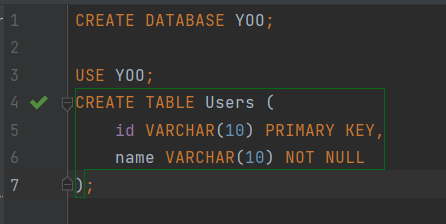

# 4주차 과제

### 테이블 생성

```sql
CREATE
DATABASE YOO;

USE
YOO;
CREATE TABLE Users
(
    id   VARCHAR(10) PRIMARY KEY,
    name VARCHAR(10) NOT NULL
);
```




### INSERT 명령어로 User 엔티티 삽입해보기

```sql
INSERT INTO Users (id, name)
VALUES ('yookm', 'Kyeongmi');
INSERT INTO Users (id, name)
VALUES ('yookm2', 'Kyeongmi2');
```


### SELECT 명령어로 User 조회하기

#### user 테이블 조회하기

```sql
SELECT *
FROM Users;
```


#### WHERE 절을 통해 User id가 yookm 인 튜플 찾아보기

```sql

SELECT *
FROM Users
WHERE id = 'yookm';
```


### UPDATE 명령어로 User 엔티티 수정하기

```sql
UPDATE Users
SET name = 'Kyeongmiii'
WHERE id = 'yookm';
```


### DELETE 명령어로 User 엔티티 삭제하기

```sql
DELETE
FROM Users
WHERE id = 'yookm';
```